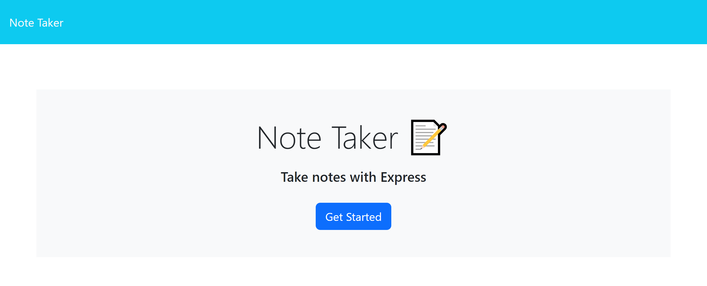
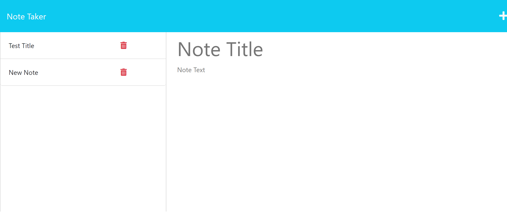

# Note_Taker    
App to write and save notes

  ## Description

  Note Taker was created for UCF bootcamp class as an application to take and save notes. The user will go use the provided typing space to enter in a title and text for a note and click the save icon to save it. The note will then be added to the list of notes appearing on the left of the page. Notes can be clicked on to be viewed or deleted by clicking the trash can icon. The application was designed to go along with learning and display student ability to utilize knowledge on JavaScript, node.js, express.js, and deploying with Heroku.

  ## Table of Contents

  1. [Installation](#installation)
  2. [Usage](#usage)
  3. [Credits](#credits)
  4. [License](#license)
  5. [Contributing](#contributing)
  6. [Tests](#tests)
  7. [Questions](#questions)

  ## Installation 

  N/A

  ## Usage 

  To use the Note Taker app, type out a note title and text in the provided space on the right side of the page. Click the floppy disk icon that appears to save the note in the list on the left of the page. Click on any note on the left to have it appear in the text space on the right. Click the plus icon to be able to add notes again. Click the trash can icon next to any note to delete it from the list.

  Screenshot of Home Page:
  

  Screenshot of Notes Page:
  

  ## Credits 

  Base code provided by the boot camp creators at [UCF Boot Camps](https://bootcamp.ce.ucf.edu/).

  ## License 

  Licensed under [MIT](LICENSE)

  ## Contributing 

  To contribute, fork the project into your GitHub account and create a pull request.

  ## Tests 

  N/A

  ## Questions 

  Github: [SienkC](https://github.com/SienkC)
  
  For any questions please reach out to me at sienkiewichc@gmail.com.